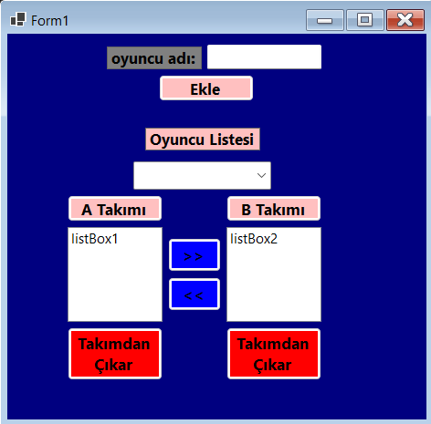

# [Takım Oluşturma Uygulaması]


Bu depo, C# Form uygulamaları ile geliştirilmiş olan **[Basit Bir Takım Oluşturma Uygulamasının]** projesinin kaynak kodlarını içerir.

## 🌟 Özellikler

Projenin temel işlevlerini ve özelliklerini listeleyin.

* [Özellik 1, Örn: Kulanıcıdan Veri alma]
* [Özellik 2, Örn: Takımlar arası oyuncu aktarımı]
* [Özellik 3, Örn: Oyuncu Kaldırma]


## Teknolojiler

Bu projede kullanılan ana teknoloji ve araçlar:

* **Dil:** C#
* **Platform:** .NET Framework 
* **Arayüz:** Windows Forms 
* **Geliştirme Ortamı:** Visual Studio 

## Kurulum ve Çalıştırma

Projeyi yerel bilgisayarınızda çalıştırmak için aşağıdaki adımları izleyin.

### Ön Gereksinimler

* [Örn: Visual Studio 2022]
* [.NET SDK]

### Adımlar

1.  **Depoyu Klonlayın:**
    ```bash
    [git clone [GitHub deponuzun URL'si]](https://github.com/sem1hX1/Takim-Olusturma-Uygulamasi)
    ```
2.  **Projeyi Açın:**
    Visual Studio'yu açın ve klasör yapısının içindeki **`.sln`** (Solution) dosyasını açın.
3.  **Çözümü Derleyin:**
    Visual Studio'da `Derle (Build)` menüsünden `Çözümü Derle (Build Solution)` seçeneğini seçin.
4.  **Uygulamayı Çalıştırın:**
    Visual Studio'da klavyeden **F5** tuşuna basarak veya `Başlat (Start)` butonuna tıklayarak uygulamayı çalıştırın.

## 📝 Kullanım

1. Oyuncu Adını Girip Ekle Buttonuna Tıklayınız
2. Açılır Menüden Eklediğiniz Oyuncuyu Seçin Ve hangi Takıma Ekleyeceğinizi Seçin
3. Orta Kısımda Bulunan Yön "<< >>" Tuşları İle Takımını Değiştirebilirsiniz
4. Takımdan Çıkar Buttonu İle Takımdan Çıkarıp Açılır Menüye Aktarabilirsiniz

* Uygulama açıldığında, [Arayüzde ne görünüyor?]
* [İlk adımı yazın, Örn: Sol taraftaki listeye veri girmek için...]
* [İkinci adımı yazın, Örn: İşlemi onaylamak için 'Aktar' butonuna tıklayın.]


---
